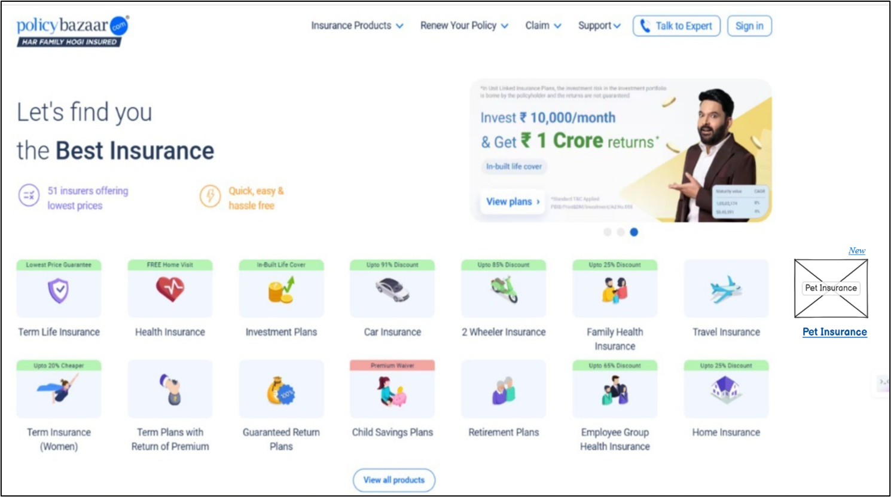
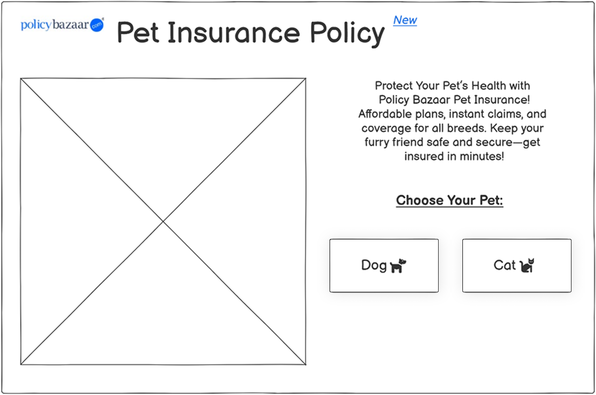
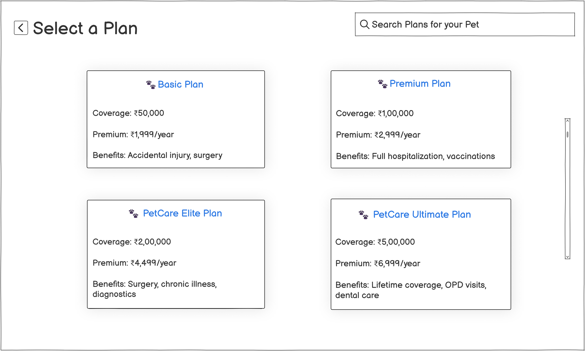
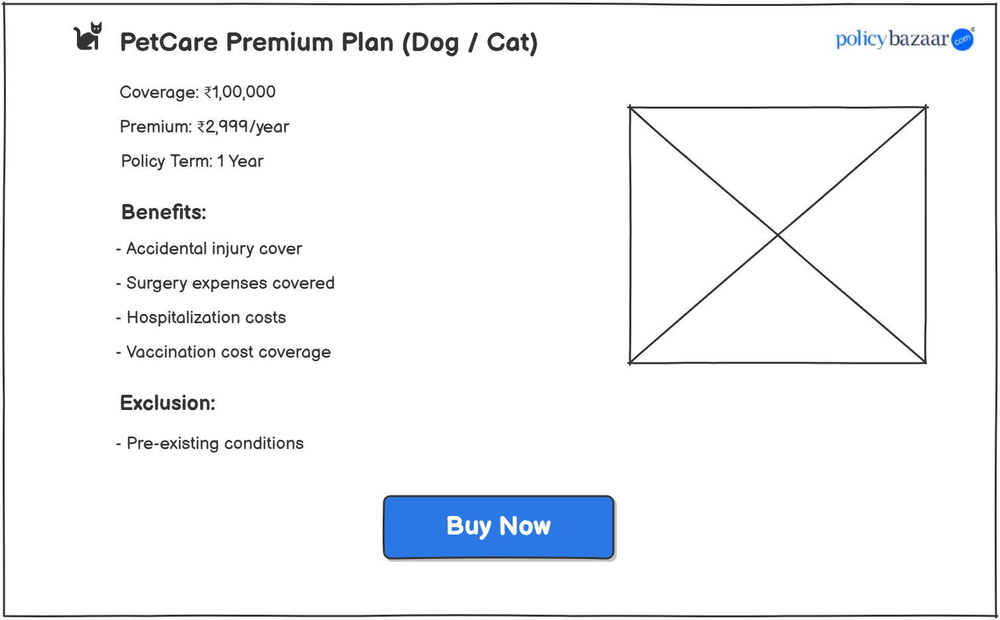
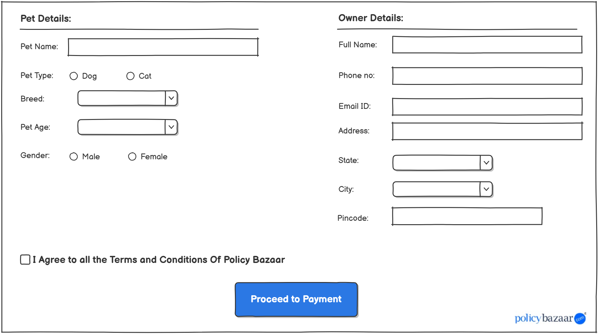
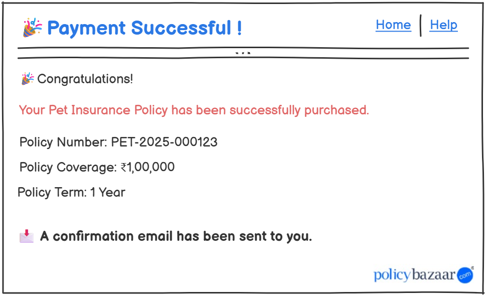

# 🐾 Policy Bazaar – Pet Insurance Module Integration

## 📌 Project Overview
This repository contains the complete **Business Analysis documentation** for the integration of a new **Pet Insurance module** into Policy Bazaar’s existing digital platform.

The goal of this initiative is to capture untapped market potential by enabling online insurance coverage for pets — specifically **cats and dogs** — directly through the existing portal.

---

## ❗ Business Problem
Policy Bazaar currently offers insurance for individuals, families, and vehicles — but **does not provide any pet insurance**, resulting in:

- Lost market opportunities  
- Decline in customer retention for pet owners  
- Customers switching to platforms offering bundled insurance (pets + humans)  
- Missed revenue growth potential  

---

## 💡 Proposed Digital Solution
To bridge this gap, the platform will introduce a **Pet Insurance feature** that allows:

- Online insurance purchase for cats and dogs  
- Coverage across all breeds  
- Hassle-free claim process for checkups, vaccinations, and treatment  
- Seamless integration with the existing payment system  

This feature aims to boost engagement, diversify product offerings, and enhance customer satisfaction.

---

## 📂 Repository Contents

| # | Folder | Description |
|---|--------|-------------|
| 1 | [**1_BRD**](1_BRD/) | Business Requirements Document – Problem, solution, and goals |
| 2 | [**2_FRD**](2_FRD/) | Functional specs for pet insurance workflows and modules |
| 3 | [**3_User_Stories**](3_User_Stories/) | User stories for pet insurance journeys |
| 4 | [**4_Use_Cases**](4_Use_Cases/) | Use cases with actors, triggers, and preconditions |
| 5 | [**5_Wireframes**](5_Wireframes/) | Visual UI concepts for pet insurance feature |
| 6 | [**6_Process_Flows**](6_Process_Flows/) | Diagrams for As-Is and To-Be states |
| 7 | [**7_Test_Cases**](7_Test_Cases/) | Test scenarios to validate the new feature |
| 8 | [**8_RTM**](8_RTM/) | Traceability from BRD to FRD to testing |
| 9 | [**9_Jira**](9_Jira/) | Jira sprint planning and story tracking screenshots |

---

## 🧾 Key Business Requirements

### 🏠 Website Updates
- Add "Pet Insurance" tab on the homepage  

### 🐶 Pet Insurance Journey
- Allow users to choose pet type (Cat / Dog)  
- Display available plans categorized by pet  
- Show plan summaries: pricing, coverage, benefits  
- Enable viewing of full plan details  
- Provide "Buy Now" CTA to start purchase  

### 🧾 Purchase & Payment
- Online form to enter pet and owner details  
- Payment via existing gateway  
- Post-payment confirmation popup and email receipt  

---

## 🛠 Tools & Techniques Used

- **Docs:** MS Word, Excel  
- **UI Tools:** Figma / Balsamiq  
- **Process Mapping:** Lucidchart / MS Visio  
- **Tracking:** Jira  
- **BA Techniques:** MoSCoW, GAP Analysis, Process Flow Mapping  

---

## 🖼️ UI Wireframe Samples

> Located in `5_Wireframes/` folder.

- Homepage banner:  
  

- Insurance selection & comparison:  
    
    
    
    
    
  

---

## 🔄 Process Flow Diagrams

> Located in `6_Process_Flows/` folder.

- **Current ("As-Is") Flow**  
  

- **Proposed ("To-Be") Flow**  
  

---

## 📋 Jira Documentation

> Located in `9_Jira/` folder – includes real Jira screenshots.

- Sprint backlog  
- Story board  
- Task allocation  

  
  

---

## 👩‍💼 About This Project

This is a **portfolio-level Business Analyst project**, demonstrating the design and implementation of a new product feature in the insurance domain.

It simulates real-world BA activities — from gap analysis to implementation-ready documentation — suitable for client-facing projects or career portfolios.

**Author:** GAURANGI JAMDAR  
**LinkedIn:** [GAURANGI JAMDAR](https://www.linkedin.com/in/gaurangi-jamdar-538b4b379)  
**Email:** gaurangijamdar.ba@gmail.com
